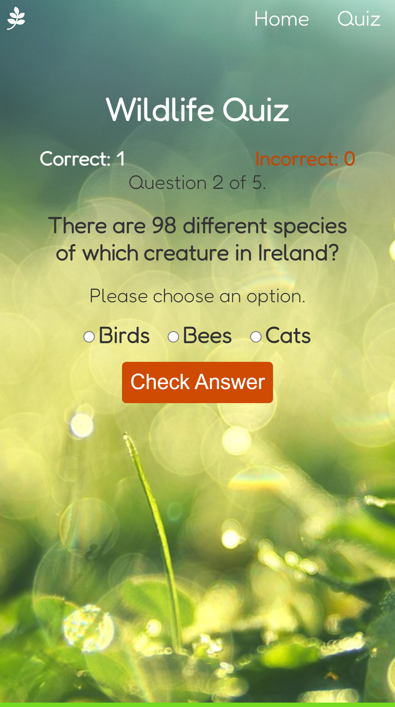

# Irish Wildlife Quiz

## Purpose

The purpose of the Nature Quiz website is to:
* provide a fun and interactive way for users to test their knowledge of wildlife in Ireland.
* develop curiosity in users about wildlife in Ireland.
* share links to useful sources of further information.

The website is targeted at adults and older children currently residing in Ireland who are 
interested in learning more or testing their knowledge of wildlife in Ireland, as well as 
adults and children elsewhere with an interest in learning more about wildlife in Ireland
or testing their knowledge of same.

## User Stories

* As a visiting user of this site, I want to test my knowledge of Irish wildlife so that I 
can be satisfied I have the correct information.
* As a visiting user of this site, I want to take a quiz on the topic of Irish wildlife so 
that I know where there are gaps in my knowledge and I can decide to learn more. 

## Features

### Navigation Bar

The navigation bar at the top of each page contains links to both pages, as well as an icon leading to the home page. All links remain visible at the top of the page while the user is on the site.

### Call to Action Button

The 'Take Quiz' button on the home page is centrally located immediately beneath the main heading. It is in a color that strongly contrasts with the background in order to draw the user's attention to it. Clicking on it brings the user directly to the first question on the quiz page.

### Quiz Question

The quiz question is located in the center of the quiz page in large font. The first question is displayed
when the quiz page loads.

### Answer Options

For every question, three possible answer options are displayed next to radio buttons. The user selects
an option then clicks on the Check Answer button immediately beneath the options. 

### 'Correct' and 'Incorrect' Answer Messages

When the user selects the correct answer and then clicks 'Check Answer', a 'Correct!' message is 
displayed. When the user selects an incorrect answer and then clicks 'Check Answer', an 'Incorrect' 
message is displayed. The 'Incorrect' message also displays the correct answer for that question.

### Score

The current score is displayed above the question section. It shows the number of correct and incorrect answers at that moment. The score resets to zero every time the quiz starts from the beginning.

### Question Number

The current question number and total number of questions are displayed above the question. The user 
knows how many questions remain before the end of the quiz. 

### 'Next Question' Button

The 'Next Question' button becomes visible whenever the user checks an answer. Clicking the 'Next Question' button removes the old question and displays a new question and new set of answer options. 

### End of Quiz Message and Final Score

On checking the answer to the final question, the user is shown a 'Well done' message which also 
shows their final score. 

## Future Features

* Multiple quiz levels (easy, medium, difficult) available to the user.
* A 'Create Username' feature.
* A 'Save Score' option for the user.

## Typography and Color Schemes

### Typography

### Color Schemes

* Green is used as the main color throughout the site and in the background image on both pages. 
It was chosen because of a strong association with wildlife and nature, the main theme of the quiz.
* Orange is used on buttons to draw attention to them due to a strong contrast with green. 
* Background and foreground color combinations have been checked where possible to ensure they 
meet WCAG AA Color Contrast requirements. 
* Color contrast was checked using [Web AIM](https://webaim.org/resources/contrastchecker/). Not all combinations could be checked due to the background image. 

## Wireframes

### Page 1 of 2: The Home Page

### Page 2 of 2: The Quiz Page

### The final score display on the quiz page

## Technology

* HTML was used to structure the pages and add features.
* CSS was used to style the features on both pages.
* JavaScript was used to add interactivity to the quiz page.
* Justinmind was used to create wireframes.
* Github was used to store code and to deploy the site.
* Gitpod was used to write and edit the code.
* Chrome DevTools was used to test the site for responsivity and detect errors.
* Font Awesome was used to source an icon for the home link in the navigation bar.

## Testing

### Code Validation

Add validation info here

### Test Cases

#### Quiz

1. Open the Home Page. The user is shown the main heading. The user notices the 'Take Quiz' button under the heading.
2. Click on 'Take Quiz'. The user is directed to the Quiz Page. The user notices the first quiz 
question.
3. Read the question. The user notices the answer options below the question.
4. Click on an answer option. The user notices the 'Check Answer' button below the answer options.
5. Click on 'Check Answer'. The user notices an answer message. 
6. Read the answer message. The user notices a 'Next Question' button.
7. Click on 'Next Question'. The user notices a new question.
8. Repeat steps 3-6 for each question.
9. Click on 'Next Question'. The user notices a 'Well done' message appear with their final score.
10. Read the message and final score.

### Fixed Bugs

Add one more fixed bug?

* One of the radio button and label answer option pairs split onto separate lines when viewing on 
a small mobile screen. This was fixed by enclosing each radio button and label pair in a span 
and giving each a property of display: inline-block.

### Supported Screens and Browsers

Add devices it has been tested on

* The site was designed mobile-first. Responsive units were used for positioning and sizing
throughout, with few exceptions.
* The website has not been tested on browsers other than Chrome.

## Deployment

### Via Gitpod

Follow the following steps to open up the site in Gitpod:

1. Go to the site https://github.com/ in a browser.
2. Open the 'SiobhanP1/nature-quiz' repository.
3. Click on the 'Gitpod' button to open up a workspace.
4. In the terminal, enter the command `python3 -m http.server`.
5. A small window will pop up. 
6. Select 'Open in browser' to open the site in a new tab.

### Via Github Pages

This site was deployed via Github Pages by doing the following:

1. Open the 'SiobhanP1/nature-quiz' repository in Github.
2. Select 'Settings'. 
3. Select 'Pages' from the sidebar.
4. Go to the Source drop-down menu and select the 'Deploy from Branch' option.
5. On the Branch drop-down menu, select 'Main'.
6. Click on the 'Save' button.
7. Wait, then refresh the page to see the site link.

The live link is https://siobhanp1.github.io/nature-quiz/quiz.html.

## Credits
### Images

* The background image of [dew on grass](https://pixabay.com/photos/grass-morning-dew-bokeh-green-3743023/) on both the home and quiz pages was taken from [Pixabay](https://pixabay.com/).

